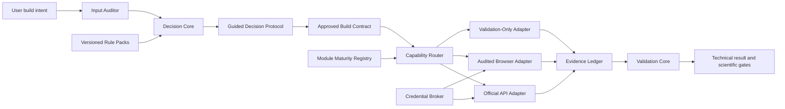

# CHARMM-GUI System Builder v2.1.0 Design Specification

Status: Draft for final specification review; all design sections approved
Date: 2026-07-21
Target release: v2.1.0
Project: CHARMM-GUI System Builder
Canonical repository: https://github.com/ChenyanLiao/CHARMM-GUI-System-Builder

## 1. Executive Summary

v2.1.0 evolves CHARMM-GUI System Builder from a primarily procedural,
cross-agent workflow into an auditable decision and execution system for
CHARMM-GUI jobs.

The product remains a **CHARMM-GUI operation skill**, not a standalone API
client. It analyzes the requested system, enumerates the parameters that must
be decided, recommends values with evidence and risk labels, obtains staged
approval, freezes an immutable build contract, and then routes only the
approved actions through an official API, an audited browser, or a read-only
validator.

The central architecture is a modular decision core with versioned rule packs,
lightweight runtime adapters, a capability router, a local credential broker,
an append-only evidence ledger, and engine-specific output validation.

v2.1.0 preserves v1.1.1 commands and validators, reads older reports and
states, and migrates them non-destructively. It does not automatically approve
production, execute docking or force-field optimization, run production MD, or
claim that a technically complete package proves a binding site or biological
mechanism.

## 2. Approved Product Decisions

The following decisions are fixed for v2.1.0:

1. Use a modular decision core, not a monolithic wizard or a plugin-first
   framework.
2. Keep one authoritative scientific and operational core for Codex, Claude,
   OpenClaw, Hermes, and compatible Agent Skills clients.
3. Treat upstream docking, QM, CGenFF, and ffTK work as auditable inputs; do not
   execute those calculations in the core.
4. Analyze each requested system before execution and enumerate all relevant
   parameter choices.
5. Use staged approvals: initial contract, membrane orientation, exceptions or
   drift, and final technical approval.
6. Classify decisions as Routine, Contextual, or Critical.
7. Store reusable background in `TARGET_PROFILE.yaml` and run-specific frozen
   decisions in `APPROVED_BUILD_CONTRACT.yaml`.
8. Use official documented APIs where available and an audited browser for
   unsupported modules.
9. Never reverse engineer or fabricate private CHARMM-GUI endpoints.
10. Support optional local credential storage through an OS credential vault,
    never through plaintext project files.
11. Bind unattended authorization to a content-addressed, time-limited,
    one-submission build contract.
12. Preserve v1.1.1 behavior through explicit, non-destructive migration.
13. Publish every module with a visible maturity level.
14. Require maintainer reproduction and at least two independent external
    groups before promoting a module to Stable.
15. Accept community validation through redacted, structured reports and
    maintainer-reviewed rule change proposals.
16. Keep all technical passes separate from scientific or production approval.

## 3. Goals

### 3.1 User Goals

- Let a user describe the system they want to build in natural language.
- Audit the supplied protein, ligand, membrane, force-field, and experimental
  context before opening CHARMM-GUI.
- Show every relevant choice, including alternatives such as NaCl versus KCl,
  concentration, internal ion names, membrane composition, missing-residue
  strategy, and output engine.
- Recommend a value for every choice that can be responsibly recommended.
- Explain the evidence, confidence, and risk behind each recommendation.
- Ask one focused question at a time for complex or high-risk decisions.
- Execute only the frozen, approved parameters.
- Recover safely after browser, API, server, or download interruption without
  duplicating jobs.
- Produce a complete audit package that another researcher can review.

### 3.2 Engineering Goals

- Separate decisions, execution transports, evidence capture, and validation.
- Make API and browser runs use the same state machine and data model.
- Prevent parameters from silently drifting between recommendation, approval,
  submitted form/API values, and generated output.
- Keep credentials out of source code, logs, screenshots, reports, fixtures,
  command history, and Git.
- Retain existing archive, GROMACS, and custom-ligand validation behavior.
- Make rule changes versioned, testable, reviewable, and non-retroactive.

### 3.3 Scientific Goals

- Preserve chemical identity, protein connectivity, and membrane orientation
  as explicit scientific gates.
- Distinguish technical package completeness from parameter quality, pose
  validity, production suitability, and biological interpretation.
- Generate an expert review package automatically when a Critical decision
  cannot be resolved.

## 4. Non-Goals

The v2.1.0 core will not:

- run docking, xTB, ORCA, QM, CGenFF optimization, or VMD ffTK fitting;
- change ligand bond order, protonation, tautomer, stereochemistry, identity,
  atom names, or atom ordering;
- repair protein sequence gaps or connectivity without an approved upstream
  model;
- submit to undocumented CHARMM-GUI endpoints;
- bypass CAPTCHA, MFA, anti-automation controls, or account restrictions;
- run `gmx mdrun` or production MD;
- use `gmx grompp -maxwarn` to turn warnings into a pass;
- infer a true binding site, pharmacological mechanism, or publication-level
  conclusion from a successful system build;
- auto-promote any job to production-ready.

## 5. Architecture



### 5.1 Input Auditor

The Input Auditor performs read-only analysis of:

- protein chains, segments, residue ranges, sequence and coordinate gaps;
- altlocs, duplicate atoms, missing coordinates, and non-standard residues;
- waters, old bulk ions, key metals, cofactors, and unrelated hetero residues;
- ligand residue name, atom count, bond order, explicit hydrogens, formal
  charge, atom names/order, and parameter provenance;
- membrane intent, target environment, and experimental conditions;
- upstream docking, QM, force-field, and expert-approval artifacts.

It produces facts and blockers. It does not alter the original inputs.

### 5.2 Decision Core

The Decision Core builds a complete parameter inventory from the audited facts,
target profile, requested builder, output engine, and rule packs. It assigns
recommendations, evidence, confidence, risk, and dependencies.

### 5.3 Versioned Rule Packs

Rule packs are organized by builder and output engine. They contain parameter
schemas, compatibility constraints, recommendation logic, risk classification,
and validation expectations. Rule packs cannot access credentials or execute
network actions.

### 5.4 Guided Decision Protocol

The protocol presents recommendations and resolves decisions one at a time.
When the runtime provides a brainstorming or grilling skill, an adapter may use
it, but the core protocol must provide equivalent behavior without a hard
dependency on a particular agent.

### 5.5 Capability Router

The router selects an official API adapter, audited browser adapter, or
validation-only adapter from an explicit capability registry. It cannot select
an undocumented transport.

### 5.6 Execution Adapters

Adapters execute already approved actions. They cannot alter recommendations,
lower risk, add hidden defaults, or bypass the contract.

### 5.7 Evidence Ledger

The ledger records state transitions and sanitized evidence as append-only
events. It is the recovery source of truth together with the locked contract
and current state file.

### 5.8 Validation Core

The Validation Core performs read-only transfer, archive, builder, engine, and
custom-parameter checks. Output requirements are derived from the contract and
engine profile rather than a single hard-coded Cav3.2 example.

## 6. Core Data Model

Each run contains the following logical records:

| Record | Purpose | Mutability |
|---|---|---|
| `TARGET_PROFILE.yaml` | Reusable target facts and reviewed preferences | Versioned |
| `RUN_REQUEST.yaml` | User intent, builder, mode, and requested outputs | Run-local |
| `INPUT_AUDIT.json` | Audited input facts and hashes | Immutable result |
| `DECISION_REGISTER.yaml` | Options, recommendations, risks, and decisions | Revisable before lock |
| `APPROVED_BUILD_CONTRACT.yaml` | Frozen inputs and approved parameters | Immutable after lock |
| `EXECUTION_AUTHORIZATION.json` | Time, action, and submission limits | Revocable |
| `RUN_STATE.json` | Current job, step, state, and resume point | Atomic updates |
| `APPROVAL_LEDGER.jsonl` | Contract, orientation, exception, and final approvals | Append-only |
| `EVIDENCE_LEDGER.jsonl` | Sanitized append-only event stream | Append-only |
| `FINAL_VALIDATION.json` | Technical result and unresolved gates | Immutable result |

Markdown review sheets are rendered from these records for people. YAML and
JSON remain the machine-readable facts.

### 6.1 Parameter Record

Every decision uses a common shape:

```yaml
parameter_id: membrane.ions.type
module: membrane_builder
page_or_step: step3
value_type: enum
available_options:
  - NaCl
  - KCl
recommended_value: NaCl
recommendation_reason: "Example only; actual text is evidence-derived."
evidence_sources: []
confidence: unknown
risk_level: Contextual
user_decision: null
contract_value: null
actual_submitted_value: null
drift_status: UNKNOWN
```

### 6.2 Build Contract

The contract freezes:

- schema version, run ID, target ID, builder, and mode;
- each input's role, path, size, and SHA-256;
- protein, ligand, membrane, solvent, ion, force-field, and output parameters;
- risk level, evidence, recommendation, and approval for every decision;
- temporary assumptions and production blockers;
- module maturity and execution route;
- a canonical contract hash.

Any material change creates a new revision and diff. It never overwrites the
approved contract. A revision invalidates the prior execution authorization.

### 6.3 Contract State

```text
draft -> reviewed -> approved -> locked -> executing
      -> completed | failed | blocked
```

`TARGET_PROFILE.yaml` may suggest values but can never carry authorization from
an earlier run.

### 6.4 Prohibited Fields

Schemas reject password, cookie, token, JWT, session, CSRF, MFA, CAPTCHA, and
equivalent secret-bearing fields. A record may contain only a local
`credential_provider_ref`.

## 7. Decision and Recommendation Model

### 7.1 Parameter Expansion

The requested system activates a dependency graph. Examples include:

- PDB Reader: chain, segment, termini, disulfide, missing residue, water, ion,
  metal, hetero-residue, and correction choices;
- Ligand Reader: residue name, identity, bond order, hydrogen count,
  protonation, charge, stereochemistry, parameter source, and penalties;
- Membrane Builder: orientation, upper/lower leaflets, lipid types and ratios,
  box type, XY/Z size, water thickness, protein projection, and packing;
- ions: salt species, concentration, neutralization, and CHARMM residue names;
- force fields: compatible protein, lipid, ligand, ion, and water models;
- output engines: engine selection and engine-specific controls;
- Solution Builder and Quick Bilayer: only the parameters relevant to those
  system types.

The Skill must not ask only for a numeric salt concentration. It must also show
candidate salts, a recommendation, internal cation/anion identifiers, evidence,
and conflicts with experimental conditions or key ions.

### 7.2 Risk Levels

- **Routine**: adopt the recommendation automatically, but display and record
  it in the contract.
- **Contextual**: show the rationale and obtain one confirmation.
- **Critical**: never use a silent default; present options and a recommended
  path one issue at a time.

The user may force deeper review of any parameter.

### 7.3 Critical Temporary Assumptions

A Critical uncertainty may use a clearly labeled temporary assumption only for
`test_only` or `Candidate_Not_For_MD`, while production remains blocked.

No temporary default may bypass uncertainty that changes:

- ligand chemical identity;
- protein connectivity or segmentation;
- membrane orientation.

Those conditions require a stop.

### 7.4 Evidence Priority

```text
User-provided experimental conditions
> approved expert or target profile
> current input audit
> official CHARMM-GUI documentation
> versioned rules and reliable literature
> agent inference
```

Any material conflict triggers a Critical interview even when a higher-priority
source exists.

### 7.5 Drift Detection

The system compares:

```text
recommendation
-> approved contract
-> actual DOM or API request
-> generated outputs
```

Each parameter is labeled `OK`, `WRONG`, `MISSING`, `UNKNOWN`, `RISK`, or
`BLOCK_PRODUCTION`. Visible controls and hidden fields must agree. A refreshed
page that changes NaCl to KCl, an unchecked GROMACS checkbox, or any equivalent
drift blocks automatic progression.

### 7.6 Staged Approvals

Approvals are separate append-only records bound to the current contract hash
and the evidence hashes available at that stage:

1. **Initial contract approval** authorizes the reviewed parameter plan.
2. **Orientation approval** binds the reviewed orientation artifact, such as
   `step2_orient.pdb`, without rewriting the initial contract.
3. **Exception or drift approval** records an explicitly accepted non-Critical
   deviation. A material parameter change creates a new contract revision
   instead of an exception record.
4. **Final technical approval** acknowledges the validation result and its
   remaining scientific blockers.

Each record includes stage, actor, timestamp, contract hash, evidence hashes,
decision, scope, approval origin, authorization assurance, and expiry where
applicable. It contains no credentials.
Critical chemical-identity, protein-connectivity, orientation, or production
blockers cannot be cleared by a generic exception approval.

## 8. API and Browser Routing

### 8.1 Documented API Scope

The initial registry recognizes only officially documented capabilities:

- Login: `POST https://charmm-gui.org/api/login`
- Job status: `GET https://charmm-gui.org/api/check_status?jobid=<JOBID>`
- Job download: `GET https://charmm-gui.org/api/download?jobid=<JOBID>`
- Quick Bilayer: `POST https://charmm-gui.org/api/quick_bilayer`

Sources:

- https://www.charmm-gui.org/?doc=api
- https://www.charmm-gui.org/?doc=api&module=quickb

The registry records the official source, last verification date, parameter
schema, offline test status, live test status, and module maturity.

### 8.2 Initial Routing Classification

| Capability | Route | Initial maturity |
|---|---|---|
| Login, status, download | Official API | Beta pending live tests |
| Quick Bilayer | Official API | Beta pending minimal live submission |
| PDB Reader submission | Audited browser | Browser-Assisted |
| Ligand Reader submission | Audited browser | Browser-Assisted |
| Protein/Membrane Builder | Audited browser | Browser-Assisted |
| Solution Builder | Audited browser | Browser-Assisted |
| Unverified modules | No submission | Validation-Only or Unsupported |

Quick Bilayer support for heteroatoms does not prove that a custom ligand and
its topology are transferred correctly. A protein-ligand Quick Bilayer route
remains Critical until that behavior is validated.

### 8.3 Single-Submission Rule

1. Verify contract hash, authorization, expiry, and remaining submission count.
2. Capture sanitized pre-submit evidence.
3. Submit once.
4. Persist a returned job ID atomically before further action.
5. Reuse that job ID for every status check, browser recovery, and download.

If a failure occurs before submission, the router may change transports. If a
POST may have succeeded but no job ID was captured, the run enters
`submission_uncertain`; it must inspect Job Retriever or available status
evidence before any retry. Once a job ID exists, no adapter may create a
replacement job automatically.

### 8.4 Runtime State Machine

```text
prepared
-> authenticated
-> submission_pending
-> submitted | submission_uncertain
-> running | waiting_user_or_authorized_action
-> backend_done
-> downloading
-> downloaded_unverified
-> technical_pass | technical_fail | blocked
```

`backend_done`, page completion, browser transfer, archive validity, package
validity, and production approval are separate states.

## 9. Credentials and Unattended Operation

### 9.1 Credential Providers

| Provider | Default | Intended maturity |
|---|---|---|
| `manual_interactive` | Yes | Stable |
| `macos_keychain` | Opt-in | Stable after security tests |
| `linux_secret_service` | Opt-in | Beta |
| `session_environment` | Opt-in, non-persistent | Restricted |
| Plaintext project file | Forbidden | Unsupported |

### 9.2 Credential Broker Requirements

- Store secrets only in an OS credential vault.
- Store only an opaque local provider reference in project records.
- Retrieve and consume the secret in the same controlled process as login.
- Never pass a password as a CLI argument, shell output, or child-process
  environment value.
- Never expose a secret to the agent conversation.
- Pause normal screenshot and DOM evidence capture during login.
- Keep JWTs in memory and reauthenticate after expiry.
- Never inspect, copy, save, or export browser cookies or sessions.
- Record only provider type, provider reference, operation time, and a redacted
  success or failure result.

Official documentation demonstrates token-file storage, but v2.1.0 deliberately
uses a stricter memory-only token policy.

### 9.3 Unattended Authorization

An unattended authorization is bound to:

- contract SHA-256;
- approved input hashes;
- target, builder, route, and mode;
- allowed actions;
- expiry;
- maximum submissions, defaulting to one.

Status queries and downloads for the approved job do not consume submission
count. Any material contract revision invalidates authorization.

A contract hash alone is not proof of user authorization. An unattended
authorization must be minted by the local Credential Broker after an explicit
approval step and protected by an integrity value derived from a separate
Keychain or Secret Service signing key. The execution path may verify that
authorization but may not mint a new one silently. Credential storage and
authorization signing use separate vault entries.

Approval records declare an assurance level:

- `local_os_confirmed`: local interactive approval, optionally protected by an
  OS confirmation prompt;
- `preauthorized_signed_contract`: a previously minted, signed, time-limited
  authorization for unattended execution;
- `remote_user_confirmed`: an explicit instruction in the current authenticated
  agent task, recorded with the contract hash;
- `agent_generated`: invalid for side-effecting execution.

`remote_user_confirmed` may authorize the already reviewed `test_only` actions
allowed by the contract. It cannot by itself clear chemical-identity, protein-
connectivity, membrane-orientation, expert-review, or production gates.

Saved credentials solve authentication only. They do not authorize Critical
parameter changes, production, CAPTCHA, MFA, account challenges, or terms
acceptance.

### 9.4 Security Boundary

An OS credential vault reduces accidental disclosure but cannot guarantee
secrecy if the local user account, operating system, or agent process is
compromised. Documentation must state this limitation. A disclaimer alone is
not a security control.

## 10. Evidence, Recovery, and Run Layout

### 10.1 Run Layout

```text
Run_<timestamp>/
  00_Inputs/
  01_Input_Audit/
  02_Decisions/
  03_Execution/
    API_Records/
    Browser_Screenshots/
    Page_Snapshots/
    Status_Checks/
  04_Downloads/
  05_Validation/
  06_Expert_Review/
  07_Logs/
  APPROVED_BUILD_CONTRACT.yaml
  EXECUTION_AUTHORIZATION.json
  RUN_STATE.json
  APPROVAL_LEDGER.jsonl
  EVIDENCE_LEDGER.jsonl
  README_RUN.md
```

Project adapters may map this layout into an existing numbered scientific
directory convention. Externally generated CHARMM-GUI and GROMACS names remain
unchanged.

### 10.2 Evidence Event

Each ledger event includes:

- timestamp, event ID, actor, and adapter;
- module, page, step, URL, and job ID;
- state before and after the action;
- contract hash and sanitized request hash;
- visible and hidden form summaries after secret filtering;
- clicked control or API action;
- warnings, errors, and external side-effect flag;
- evidence file paths and hashes;
- the next permitted action.

### 10.3 Resume Algorithm

1. Load the locked contract, current state, and last ledger event.
2. Inspect existing job IDs, page state, API status, and server artifacts.
3. Classify the last action as verified complete, uncertain, or not submitted.
4. Resume from the last verified checkpoint.
5. Never repeat upload, submit, Next, or download actions without evidence that
   no external side effect occurred.

### 10.4 Polling

- Use approximately 10-15 minute intervals for small steps.
- Use 30-60 minute intervals for packing or large builds.
- Record output size, tail, modification time, and key files each round.
- Mark `possibly_stalled` after two unchanged rounds with missing key products.
- Stop polling when the page requires the next approved human or automated
  action.
- Do not repeatedly refresh or click Next.

### 10.5 Download Recovery

The system distinguishes:

```text
backend_done
page_download_available
transfer_in_progress
downloaded_unverified
archive_validated
package_validated
```

Rules:

- Resume only the newest interrupted browser download.
- Do not click the website download link repeatedly.
- Switch from Chrome to Safari after repeated transfer failure without rerunning
  the CHARMM-GUI job.
- Expect Safari to save an automatically expanded `.tgz` as a plain `.tar`.
- Never trust an extension or browser-reported size.
- Detect gzip tar, plain tar, HTML, partial, corrupt, intermediate, and unsafe
  archives by content.
- Check size, SHA-256, member safety, and required payload before moving a file
  from a default Downloads directory into the run.
- Treat a network failure as a transfer failure, not a backend failure.

## 11. Validation Model

Validation has four layers.

### 11.1 Transfer and Archive

- Identify actual file type and compression.
- Report size and SHA-256.
- Distinguish HTML, partial, corrupt, intermediate, final-candidate, and unsafe
  archives.
- Define whether `archive_member_count` counts all members or regular files.
- Reject absolute paths, `..` traversal, and dangerous link members.

### 11.2 Builder Completeness

- Verify the expected builder reached the required terminal step.
- Parse normal and abnormal termination markers.
- Compare actual protein, ligand, lipid, solvent, ion, segment, orientation,
  and missing-residue results with the contract.
- Preserve warnings and unresolved mismatches.

### 11.3 Output Engine

For GROMACS:

- require `.gro`, `.top`, `.itp`, and `.mdp`;
- require `step5_input.out` normal termination without a later abnormal marker;
- resolve `topol.top` includes and `[ molecules ]` components;
- compare contract-derived protein segments, ligand, key ions, lipids, water,
  and salt components;
- optionally run strict `gmx grompp` without `-maxwarn`;
- never run `gmx mdrun`.

Other engines require separate profiles. A missing mature validator yields
`Validation-Only`, not a borrowed GROMACS pass.

### 11.4 Custom Ligand Parameters

Accept both:

- an independent `lig.str`; or
- `lig.rtf + lig.prm` without an independent STR.

For GROMACS, validate semantics instead of textual identity:

- atom count, names, ordering, types, and charges;
- total ligand charge;
- dihedral connectivity in `LIG.itp`;
- parameter values in `toppar/forcefield.itp` `[ dihedraltypes ]`;
- kcal/mol to kJ/mol conversion by 4.184;
- forward or reverse atom-type order;
- phase modulo 360;
- function, multiplicity, phase, and force constant;
- all changed terms and primary optimized terms.

The report must explain that CHARMM-GUI may store function-9 connectivity in
`LIG.itp` and converted numerical values in `forcefield.itp`. Missing
standalone `lig.str` is not a failure when RTF/PRM and GROMACS dihedral types
are complete.

### 11.5 Final Technical Status

Technical validators emit only:

- `Technical_Pass_Not_Production_Approval`
- `Technical_Fail`
- `Blocked_Pending_Expert_Review`
- `Incomplete_Or_Unknown`

For backward compatibility, legacy `Production_Approved` can be read and
reported as a historical state, but a v2.1 technical validator does not emit
it. A separate policy record may state that all required expert approvals were
present; that statement still does not prove a binding site or mechanism.

## 12. Expert Review Package

When a Critical decision blocks execution, generate a review package containing:

- the precise unresolved question;
- input evidence and conflicts;
- feasible options;
- the recommended option and its rationale;
- risks of each option;
- the required expert discipline;
- relevant files and hashes;
- the exact contract field that remains unapproved;
- the state and command or action needed to resume.

The package must not contain secrets or unredacted private browser state.

## 13. Cross-Agent Design

The repository maintains one core:

```text
CHARMM-GUI-System-Builder/
  SKILL.md
  core/
  rules/
  adapters/
  security/
  community/
  templates/
  examples/
  tests/
```

Runtime adapters map file, terminal, browser, screenshot, download, native
dialog, credential-vault, and interactive-question capabilities. They cannot
change scientific rules or contract gates.

At startup, each adapter produces a capability manifest. Missing capabilities
lower the effective maturity or produce an operator handoff. They do not create
fabricated tool calls or claimed success.

## 14. v1.1.1 Compatibility and Migration

v2.1.0 retains:

- existing CLI commands and primary arguments;
- current download, archive, GROMACS, and ligand-injection validation behavior;
- old JSON and Markdown report readers;
- existing cases as regression fixtures.

Migration is read-only and non-destructive:

1. Load the old state or profile.
2. Map known fields to v2.1 schema.
3. Produce `MIGRATION_REPORT.md` and `MIGRATION_REPORT.json`.
4. Mark unknown or ambiguous fields explicitly.
5. Require confirmation for Critical unknowns.
6. Write a new v2.1 copy without modifying the old record.

Old cases never become approved contracts merely because they were migrated.

## 15. Module Maturity and Community Validation

### 15.1 Maturity Levels

- `Stable`
- `Beta`
- `Browser-Assisted`
- `Validation-Only`
- `Unsupported`

At release time, the registry assigns maturity from recorded evidence rather
than inheriting a label from v1.1.1. Archive/download, GROMACS package, and
custom-ligand validators are Stable candidates; if the Stable evidence gate is
not documented, they ship as Beta. Official API adapters begin as Beta, the
interactive builders begin as Browser-Assisted, and output engines without a
mature validator begin as Validation-Only.

### 15.2 Stable Promotion Gate

A module reaches Stable only after:

1. automated unit and integration tests;
2. maintainer reproduction;
3. reproduction by at least two independent external laboratories or groups;
4. no unresolved high-severity defects;
5. complete documentation, recovery behavior, and scientific boundaries.

### 15.3 Community Reports

Community reports may include builder, target category, Skill version, redacted
contract summary, failed or successful step, warnings, errors, and validation
result. They must not include credentials, browser sessions, unauthorized
private structures, identifying screenshots, or license-restricted complete
output packages.

Contributors may be credited in `COMMUNITY_VALIDATORS.md` and repository
history. Validation does not automatically promise paper authorship.

### 15.4 Rule Change Lifecycle

```text
Validation Report
-> Rule_Change_Proposal
-> Maintainer Review
-> Tests and Reproduction
-> Versioned Rule Pack Merge
```

Community evidence never changes recommendations automatically. New rule
versions affect future contracts only.

### 15.5 Public Recruitment

A WeChat article and GitHub discussion may invite laboratories to test public
or shareable systems. They must clearly describe the project as unofficial,
require redaction, and distinguish workflow testing from scientific evidence.

## 16. Test Strategy

### 16.1 Offline Automated Tests

The suite must cover:

- every existing v1.1.1 test;
- v2.1 schemas and parameter dependency expansion;
- risk classification and evidence conflicts;
- contract hashing, revisions, expiry, and authorization invalidation;
- one-submission and `submission_uncertain` behavior;
- API capability registry and HTTP mocks;
- credential-provider mocks and secret redaction;
- browser drift and login-evidence suppression;
- gzip tar, plain tar, misleading extensions, HTML, partial, corrupt,
  intermediate, and unsafe archives;
- GROMACS package and custom-ligand injection validation;
- non-destructive v1.1.1 migration;
- capability manifests for Codex, Claude, OpenClaw, and Hermes.

CI uses only fictional credentials. Real CHARMM-GUI credentials must never be
stored in GitHub Actions.

### 16.2 Live Test Tiers

1. **Read-only smoke test**: official documentation reachability and status or
   download for an existing authorized job; no new submission.
2. **Minimal API submission**: an explicitly authorized public membrane-only
   Quick Bilayer test; one submission; `test_only_not_for_production`.
3. **Complex local case**: Cav3.2 + ZHJ36 may be used as a private,
   browser-assisted end-to-end acceptance case with redacted public evidence.

Docking, ligand parameter quality, membrane orientation, and scientific
interpretation remain independent Critical gates in the ZHJ36 case.

## 17. Release Gates

Before tagging v2.1.0:

- all v1.1.1 tests pass;
- all new tests pass;
- package validation passes;
- v1.1.1 migration fixtures pass;
- API offline contract tests pass;
- at least one read-only live smoke test is recorded;
- Quick Bilayer remains Beta if no real minimal submission has been completed;
- a secret scan finds no credentials in repository files, fixtures, logs, or
  reports;
- archive, GROMACS, and custom-ligand regression cases pass;
- every module has a documented maturity level;
- `production_ready=false` and `no_mdrun=true` safety assertions remain;
- code review and behavior-preserving simplification are complete;
- installation diff, rollback instructions, and release notes exist;
- the user approves commit, tag, and GitHub push.

The project skill directory is upgraded and tested before any installed copy is
replaced. Installation must not overwrite an existing global skill without a
diff and rollback path.

## 18. Error Handling Principles

- Fail closed when a secret filter, contract check, or Critical gate fails.
- Preserve exact warnings and root-cause evidence.
- Do not translate network failure into backend failure.
- Do not translate backend completion into archive or package validity.
- Do not translate technical stability into scientific validity.
- Do not retry a side-effecting action when its outcome is uncertain.
- Stop a repeatedly failing branch instead of retrying indefinitely.
- Generate an expert or operator handoff that identifies the last verified
  checkpoint and exact resume action.

## 19. Implementation Sequence

Implementation planning must decompose the approved design into independently
testable stages. The expected order is:

1. schemas, status vocabulary, and migration reader;
2. decision records, risk model, and contract locking;
3. capability registry and transport-neutral state machine;
4. evidence ledger and recovery logic;
5. API status/download and offline Quick Bilayer contract adapter;
6. credential-provider interface and secure mocks;
7. browser adapter integration and drift capture;
8. contract-derived validation profiles;
9. cross-agent capability manifests;
10. community validation templates and maturity registry;
11. live smoke tests, review, simplification, documentation, and release.

This section defines ordering only. It does not authorize implementation,
external submission, credential setup, release, or GitHub push.

## 20. Acceptance Criteria

The design is implemented successfully when a user can:

1. describe a CHARMM-GUI system in natural language;
2. receive an exhaustive, risk-ranked parameter review with recommendations;
3. approve an immutable, hashed build contract;
4. optionally authorize one unattended submission through a local credential
   vault without exposing the secret;
5. execute through a documented API or audited browser without duplicate jobs;
6. resume from an interruption using recorded evidence;
7. recover and validate a download independent of filename or browser behavior;
8. validate a contract-derived GROMACS package and custom ligand parameters;
9. receive a technical result that preserves all scientific blockers;
10. migrate v1.1.1 artifacts without modifying them;
11. use the same scientific core from Codex, Claude, OpenClaw, or Hermes.

## 21. Remaining Implementation-Level Choices

The following choices may be resolved during implementation without changing
the approved behavior:

- exact Python schema library;
- native macOS Keychain and Linux Secret Service binding;
- canonical serialization implementation for contract hashing;
- local append-only ledger storage details;
- exact adapter command names and installation paths.

Any choice that weakens credential isolation, changes a risk gate, adds an
undocumented API, changes submission semantics, or changes final scientific
status requires a design revision and renewed approval.
